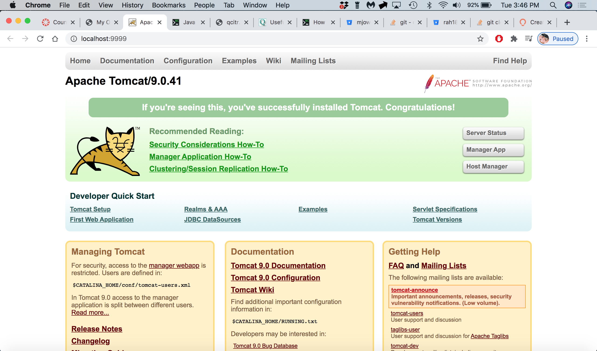
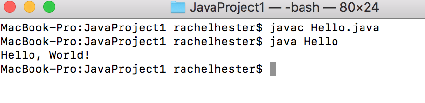
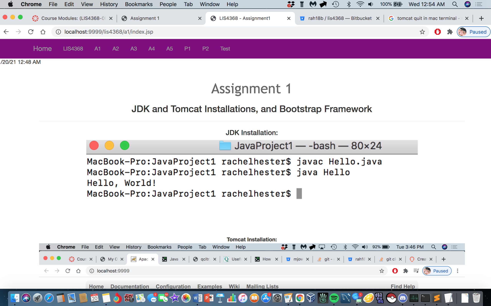

> **NOTE:** This README.md file should be placed at the **root of each of your repos directories.**
>
>Also, this file **must** use Markdown syntax, and provide project documentation as per below--otherwise, points **will** be deducted.
>

# LIS4368 Advanced Web Applications Development

## Rachel Hester

### Assignment 1 Requirements:

*Three Ports:*

1. Distributed Version Control with Git and Bitbucket
2. Java/JSP/Servlet Development Installation
3. Chapter Questions (Chs 1 - 4)

#### README.md file should include the following items:

* Screenshot of running java Hello (#1 above):
* Screenshot of running http://localhost9999 (#2 above Step #4(b) in tutorial):
* git commands w/short descriptions
* Bitbucket repo links: a) this assignment and b) the completed tutorial above (bitbucketstationlocations).

> This is a blockquote.
> 
> This is the second paragraph in the blockquote.
>
> #### Git commands w/short descriptions:

1. git init - creates new Git repository
2. git status - displays the state of the working directory and the staging area
3. git add - adds a change in the working directory to the staging area
4. git commit - used to save your changes to local repository
5. git push - used to upload local repository content to a remote repository
6. git pull - used to fetch and download content from a remote repository and immediately update the local repository to match that content
7. git uncommit - uncommit your last commit in git 

#### Assignment Screenshots:

*Screenshot of AMPPS running http://localhost*:

*Screenshot of running java Hello*:

*Screenshot of running A1 on Tomcat*

#### Tutorial Links:

*Bitbucket Tutorial - Station Locations:*
[A1 Bitbucket Station Locations Tutorial Link](https://bitbucket.org/rah18b/bitbucketstationlocations/src/master/ "Bitbucket Station Locations")

*LIS4368 Assignment 1:*
[A1 Link](https://bitbucket.org/rah18b/lis4368/src/master/ "LIS4368 - Assignment 1")

