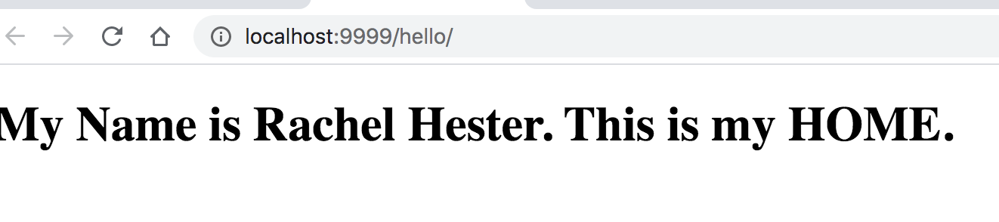
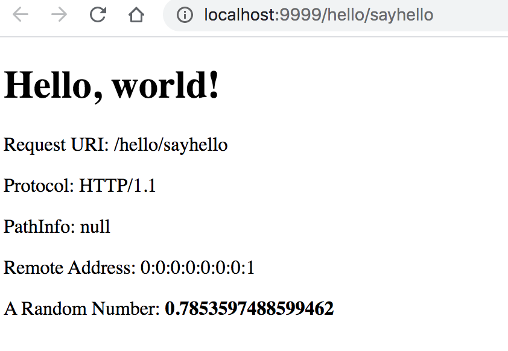
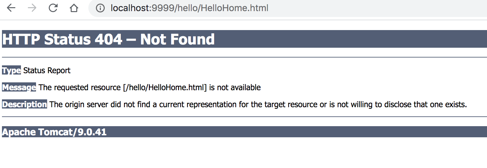
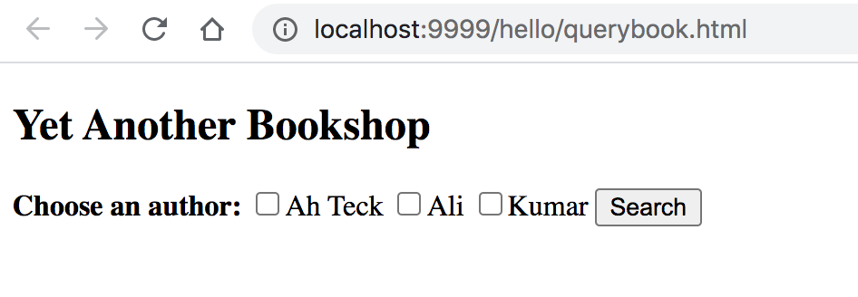
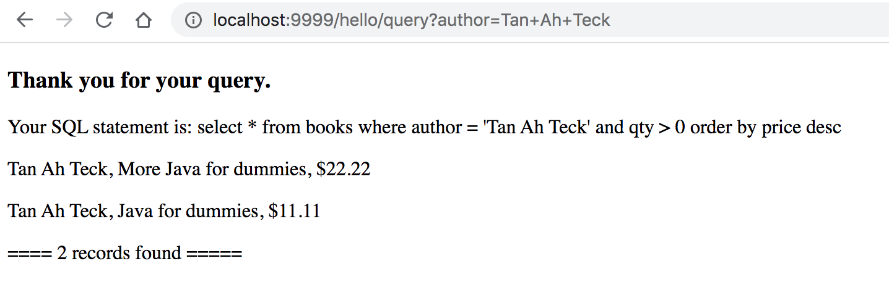
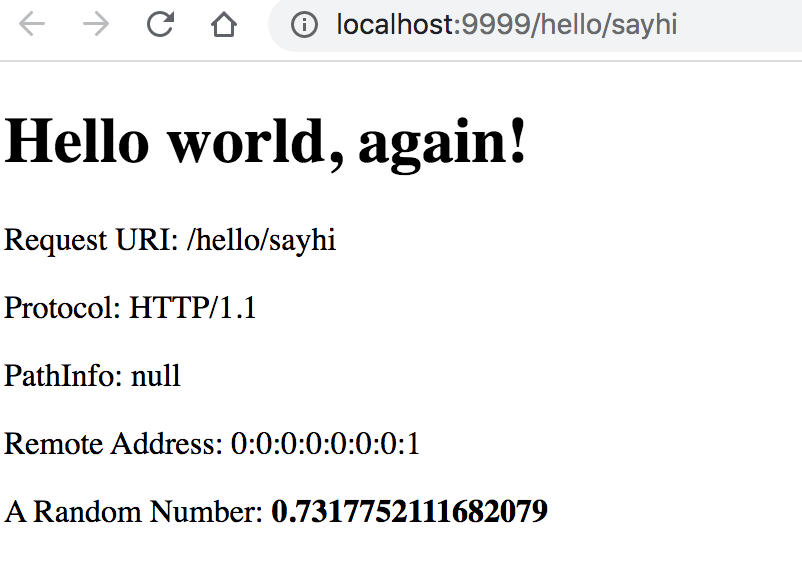
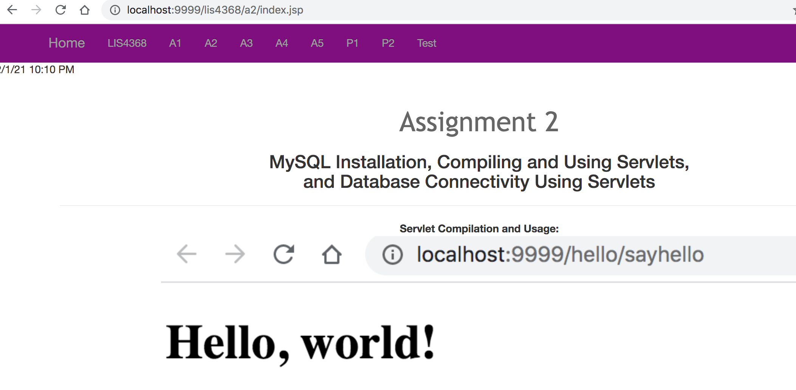

> **NOTE:** This README.md file should be placed at the **root of each of your repos directories.**
>
>Also, this file **must** use Markdown syntax, and provide project documentation as per below--otherwise, points **will** be deducted.
>

# LIS4368

## Rachel Hester 

### Assignment 2 Requirements:

*Assessment: the following links should properly display (see screenshots below):*

1. http://localhost:9999/hello(Displays directory! It should not! Needs index.html)
2. http://localhost:9999/hello/HelloHome.html(Rename"HelloHome.html" to "index.html"so that users cannot see your files!)
3. http://localhost:9999/hello/sayhello(invokes HelloServlet) Note: /sayhello maps to HelloServlet.class(changed web.xml file)
4. http://localhost:9999/hello/querybook.html
5. http://localhost:9999/hello/sayhi (invokes AnotherHelloServlet)

#### README.md file should include the following items:

* Assessment links (as above), and
* Only *one* screenshot of the query results from the following link (see screenshot below): http://localhost:9999/hello/querybook.html

> This is a blockquote.
> 
> This is the second paragraph in the blockquote.
>

#### Assignment Screenshots:

*Screenshot of running Hello*:

*Screenshot of running HelloServlet*:

*Screenshot of HelloHome change*:

*Screenshot of querybook*:

*Screenshot of query results*:

*Screenshot of running AnotherHelloServlet*:

*Screenshot of localhost A2 link*:

