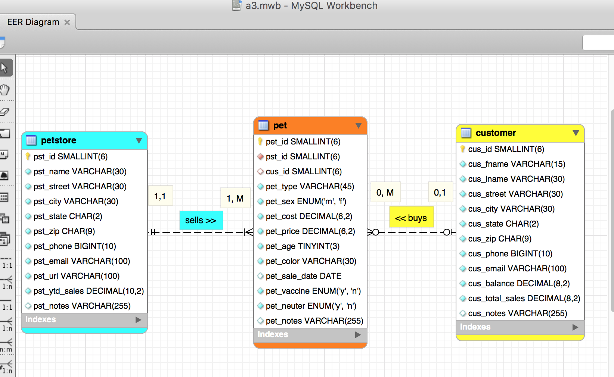
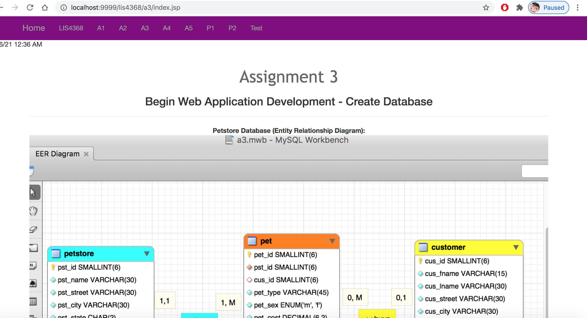

> **NOTE:** This README.md file should be placed at the **root of each of your repos directories.**
>
>Also, this file **must** use Markdown syntax, and provide project documentation as per below--otherwise, points **will** be deducted.
>

# LIS4368

## Rachel Hester 

### Assignment 3 Requirements:

*Deliverables*

1. Entity Relationship Diagram (ERD)
2. Include data (at least 10 records each table)
3. Provide Bitbucketread-only access to lis4368repo, include links to the repos you created in the above tutorials in README.md, using Markdown syntax (README.md must also include links and screenshot(s) as per above.)

#### README.md file should include the following items:

1. Course title, your name, assignment requirements, as per A1;
2. Screenshot of ERD;
3. Screenshot of a3/index.jsp
4. Links to the following files: a. a3.mwb b. a3.sql

> This is a blockquote.
> 
> This is the second paragraph in the blockquote.
>

#### Assignment Screenshots:

*Screenshot of A3 ERD*:

*Screenshot of A3 index.jsp*:

*A3 docs: a3.mwb and a3.sql*:

[A3 MWB File](docs/a3.mwb "A3 ERD in .mwb format")

[A3 SQL File](docs/a3.sql "A3 SQL Script")

