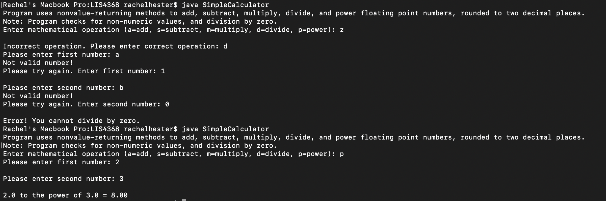

> **NOTE:** This README.md file should be placed at the **root of each of your repos directories.**
>
>Also, this file **must** use Markdown syntax, and provide project documentation as per below--otherwise, points **will** be deducted.
>

# LIS4368

## Rachel Hester 

### Assignment 5 Requirements:

*Deliverables*

1. Provide Bitbucketread-only access to lis4368repo, include links to the other assignment repos you created in README.md, using Markdownsyntax(README.mdmust also include screenshots as per above.)
2. Blackboard Links:lis4368 Bitbucket repo

#### README.md file should include the following items:

1. Course title, your name, assignment requirements, as per A1;
2. Screenshot of Skillsets 13 - 15
3. Screenshot of Valid User Form Entry
4. Screenshot of Passed Validation
5. Screenshot of Associated Database Entry 

> This is a blockquote.
> 
> This is the second paragraph in the blockquote.
>

#### Assignment Screenshots:

*Screenshot of SS13*:

*Screenshot of SS14*:

*Screenshot of SS15*:

*Screenshot of Valid User Form Entry*:

*Screenshot of Passed Validation*:

*Screenshot of Associated Database Entry*:

