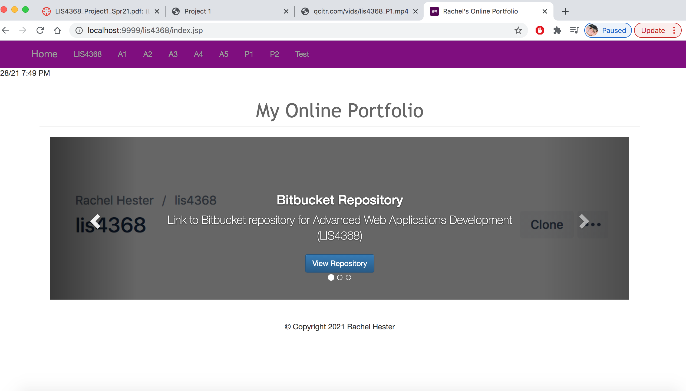
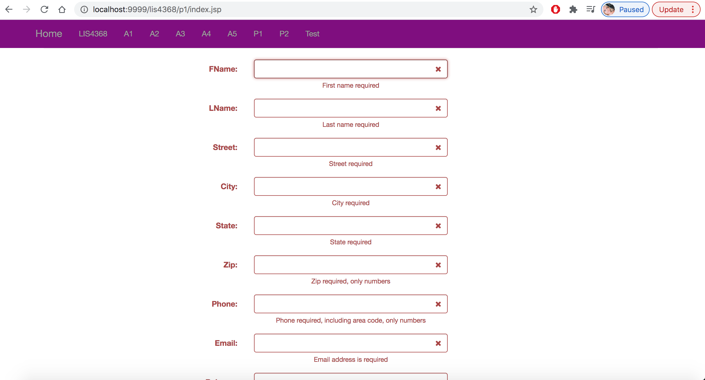
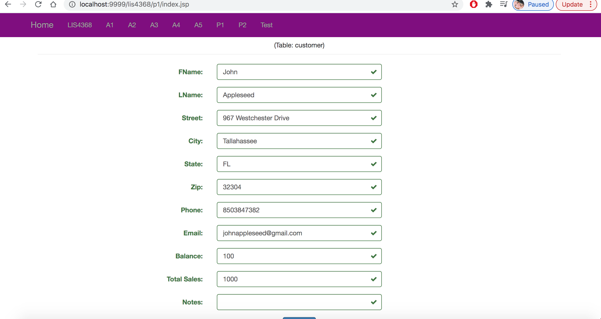

> **NOTE:** This README.md file should be placed at the **root of each of your repos directories.**
>
>Also, this file **must** use Markdown syntax, and provide project documentation as per below--otherwise, points **will** be deducted.
>

# LIS4368

## Rachel Hester 

### Project 1 Requirements:

*Deliverables*

1. Provide Bitbucket read-only access to lis4368 repo, include links to the other assignment repos
you created in README.md, using Markdown syntax
(README.md must also include screenshots as per above.)
2. Blackboard Links: lis4368 Bitbucket repo
3. *Note*: the carousel *must* contain (min. 3) slides that YOU created, that contain text and images that link to other content areas marketing/promoting your skills.

#### README.md file should include the following items:

1. Course title, your name, assignment requirements, as per A1;
2. Screenshot of Main/Splash page
3. Screenshot of Failed Validation
4. Screenshot of Passed Validation

> This is a blockquote.
> 
> This is the second paragraph in the blockquote.
>

#### Assignment Screenshots:

*Screenshot of Main/Splash Page*:

*Screenshot of Failed Validation*:

*Screenshot of Passed Validation*:

