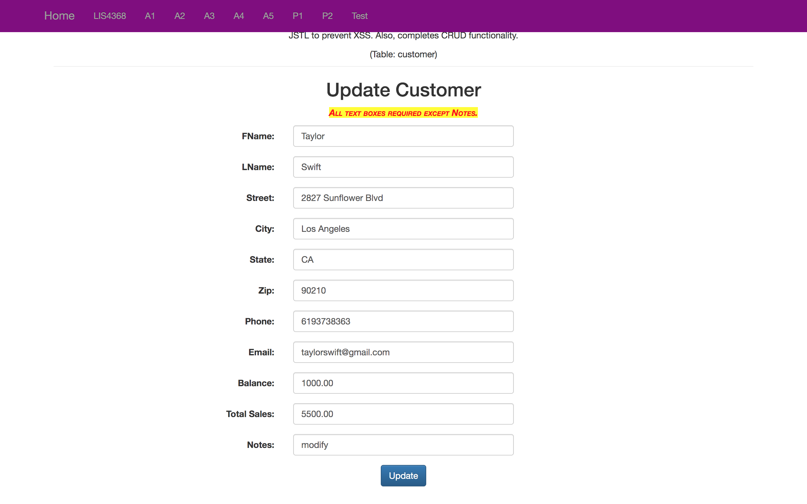

> **NOTE:** This README.md file should be placed at the **root of each of your repos directories.**
>
>Also, this file **must** use Markdown syntax, and provide project documentation as per below--otherwise, points **will** be deducted.
>

# LIS4368

## Rachel Hester 

### Project 2 Requirements:

*Deliverables*

1. Provide Bitbucketread-only access to lis4368repo, includelinks to the other assignment repos you created in README.md, using Markdownsyntax(README.mdmust also include screenshots as per above and below.)
2. Blackboard Links:lis4368Bitbucketrepo

#### README.md file should include the following items:

1. Course title, your name, assignment requirements, as per A1;
2. Screenshot of valid user form entry
3. Screenshot of Passed Validation
3. Screenshot of Displayed Data
4. Screenshot of Modify Form
5. Screenshot of Modified Data
6. Screenshot of Delete Warning
7. Screenshot of Associated Database Changes 

> This is a blockquote.
> 
> This is the second paragraph in the blockquote.
>

#### Assignment Screenshots:

*Screenshot of valid user form entry*:

*Screenshot of Passed Validation*:

*Screenshot of Display Data*:

*Screenshot of Modify Form*:

*Screenshot of Modified Data*:

*Screenshot of Delete Warning*:

*Screenshot of Associated Database Changes*:

